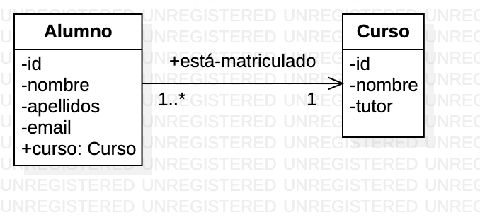

# Ejemplo 2 - Asociaciones ManyToOne y OneToMany

## Antencedentes

- Partimos del proyecto del [Ejemplo 1](https://github.com/lmlopezmagana/bbdd-2023/tree/master/PrimerProyectoDataJpa).
- En él creamos un nuevo proyecto de Spring Boot con las dependencias necesarias (web, data, h2, lombok)
- Configuramos nuestra conexión a base de datos a través del fichero de _properties_.
- Estructuramos algunos de los paquetes de nuestra aplicación.
- Construimos nuestra primera entidad, `Alumno`, añadiendo las anotaciones necesarias.
- Creamos también un repositorio para gestionar la entidad creada en el paso anterior.

## Asociación _Muchos-A-Uno_

### ¿Qué vamos a crear?

1. Una nueva entidad, que está asociada con la anterior.
2. La asociación entre ambas entidades.

### ¿Cuál es nuestro modelo de datos?


### Algo de teoría sobre asociaciones _ManyToOne_

Una asociación _muchos-a-uno_ es una asociación que relaciona dos clases, de forma que una instancia del lado _uno_ (en nuestro caso, curso), puede asociarse con varias instancias del lado _muchos_, (en nuestro caso, los alumnos).

Para poder implementar esto en nuestra aplicación necesitamos:

1. Trasladar la entidad del lado _muchos_.
2. Trasladar la entidad del lado _uno_.
3. Añadir los elementos necesarios para implementar la asociación.

**¿Cómo impacta esto en nuestro sistema?**

Como norma general:

- La entidad del lado _muchos_ tendrá su repositorio.
- La entidad el lado _uno_ también tendrá su repositorio.

### Paso 0: Diseño de la solución orientada a objetos

Si determinamos que vamos a darle un enfoque unidireccional, el diagrama de clases de la solución al problema sería este:



### Paso 1: Creamos la segunda entidad

Es muy parecida a la que ya tenemos creada

```java
@@Entity
@Data
@NoArgsConstructor
@AllArgsConstructor
@Builder
public class Curso {

    @Id
    @GeneratedValue
    private Long id;

    private String nombre, tutor;
}
```

### Paso 2: Creamos el repositorio

```java
public interface CursoRepository 
		extends JpaRepository<Curso, Long> {

}
```

## Paso 3: Modificación de la clase `Alumno` para registrar la asociación entre clases

Para añadir los elementos necesarios para poder registrar la asociación entre ambas clases tenemos que modificar nuestra clase `Alumno`. Necesitamos saber, para cada instancia de `Alumno`, cual es su instancia de `Curso` correspondiente. Por tanto, tenemos que añadir una propiedad a la primera clase, de este segundo tipo.

```java
@Entity
@Data
@NoArgsConstructor
@AllArgsConstructor
@Builder
public class Alumno {
	
	@Id
	@GeneratedValue
	private long id;
	
	private String nombre;
	private String apellidos;
	private String email;
	
	private Curso curso;
}
```

**Sin embargo, esto por sí solo no es suficiente**. JPA (en nuestro caso, Spring Data JPA) nos pide que identifiquemos esta asociación, para que la traslade al DDL (si corresponde) y la pueda manejar. Todo ello lo conseguimos a través de la anotación `@ManyToOne`.

El código, finalmente, quedaría así:

```java
@Entity
public class Alumno {
	
	@Id
	@GeneratedValue(strategy=GenerationType.AUTO)
	private long id;
	
	private String nombre;
	private String apellidos;
	private String email;

    @ManyToOne
    @JoinColumn(foreignKey = @ForeignKey(name="fk_alumno_curso"))
    private Curso curso;

}

```

> La anotación `@JoinColumn` nos permite cambiar el nombre de la columna que hace las veces de clave externa, así como el nombre de la restricción.

Si ejecutamos el proyecto, podemos apreciar el DDL generado

```sql
create table alumno (
	id bigint not null, 
	apellidos varchar(255), 
	email varchar(255), 
	nombre varchar(255), 
	curso_id bigint, 
	primary key (id)
);

create table curso (
	id bigint not null, 
	nombre varchar(255), 
	tutor varchar(255), primary key (id)
);

alter table alumno 
add constraint fk_alumno_curso 
foreign key (curso_id) references curso;
```

Podemos apreciar como:

- Se añade un nuevo atributo, llamado `curso_id`, cuyo tipo es el mismo que el del Id de `Curso`.
- Se añade también una restricción de clave externa para este atributo.

## Asociaciones _uno-a-muchos_

Normalmente, cuando se estudia UML, se suelen aprender las asociaciones y su multiplicidad (en ocasiones, conocida como _cardinalidad_ ) sin tener en cuenta la dirección. Por ejemplo, en el siguiente
diagrama:


La asociación `está-en` entre las clases `Alumno` y `Curso` se suele decir que es una asociación _uno a muchos_. Sin embargo, viendo el ejemplo anterior hemos comprobado que depende de la forma en que leamos la asociación, será de un tipo u otro:

- Si la leemos desde `Alumno` a `Curso`, tendremos una asociación _muchos-a-uno_.
- Si la leemos desde `Curso` a `Alumno`, tendremos una asociación _uno-a-muchos_.

**¿Qué alternativas de tratamiento tenemos en estos casos?** Ciertamente, JPA nos ofrece varias formas de implementar una asociación uno a muchos. Cada una con sus ventajas y desventajas:

| **Estrategia** 	| Ventajas 	| Desventajas 	|
|------------	|----------	|-------------	|
| Implementar solo la asociación _muchos-a-uno_ (solo utilizados `@ManyToOne`) | Implementación fácil. Basta incluir la anotación `@ManyToOne`en el lado muchos, y JPA crea todo lo necesario por nosotros. 	| En el lado uno, no tenemos conocimiento de las instancias del lado muchos con la cuál está asociada 	|
| Implementar solo la asociación _uno-a-muchos_ (solo usamos `OneToMany`) | Implementación fácil. Tan solo usamos la anotación `@OneToMany` en el lado uno. Esta anotación va asociada a una colección (de tipo `List` o `Set`| Muy bajo rendimiento. Se genera una tabla intermedia, y se realizan múltiples operaciones para inserción, actualización y consulta. 	|
| **Implementación _bidireccional_: se utiliza la anotación `@ManyToOne` en el lado muchos, y `@OneToMany` en el lado uno.**  | Toda la asociación se maneja a través de una _clave externa_, con lo que ganamos en rendimiento. | Implementación más compleja. Requiere de métodos auxiliares que mantengan el estado de la asociación en ambos extremos. 	|
| **Implementar solo la asociación _muchos-a-uno_ y utilizar consultas para obtener la información del lado _uno-a-muchos_** | Fácil implementación de entidades. Solo _penalizamos_ el rendimiento del sistema en el momento de consultar. Muy útil para aquellos que saben SQL/JPQL | Implementación de consultas más compleja.

Como podemos ver en el énfasis del texto, por cuestiones de rendimiento las mejores opciones son las dos últimas. En este ejemplo veremos la **implementación bidireccional**.

### Paso 0: Diseño de la solución orientada a objetos

Si determinamos que vamos a darle un enfoque bidireccional, el diagrama de clases de la solución al problema sería este:


### Paso 1: Asociación en el lado _muchos_

Ya la tenemos del ejemplo anterior:

```java
@Entity
public class Alumno {
	
	@Id
	@GeneratedValue(strategy=GenerationType.AUTO)
	private long id;
	
	private String nombre;
	private String apellidos;
	private String email;

    @ManyToOne
    @JoinColumn(foreignKey = @ForeignKey(name="fk_alumno_curso"))
    private Curso curso;

}

```

### Paso 2: Implementación en el lado _uno_

#### Algo de teoría

Como hemos visto antes, la anotación que ofrece JPA para las asociaciones _uno-a-muchos_ es `@OneToMany`. Dicha anotación debe ir asociada a una colección. Si revisamos la documentación o la literatura al respecto, encontramos:

- En el caso de las asociaciones `@OneToMany` unidireccionales, recomiendan el uso de `Set`.
- En el caso de las asociaciones **`@OneToMany`** **bidireccionales**, podemos utilizar `List` sin ver penalizado el rendimiento.

```java
@OneToMany
private List<Alumno> alumnos;
```

Sin embargo, con esta información no basta. **Como queremos darle a nuestra asociación un tratamiento bidireccional**, necesitamos indicar que esta asociación _uno-a-muchos_ viene _mapeada_ por una asociación _muchos-a-uno_. La forma de hacerlo es mediante el atributo `mappedBy` de la propia anotación. **Tenemos que indicar el nombre del atributo de la clase opuesta (en nuestro caso, `Alumno`, que está anotado con `@ManyToOne`)**.


`@ManyToOne`
```java
@ManyToOne
private Curso curso;
``` 

`@OneToMany`
```java
@OneToMany(mappedBy="curso")
private List<Alumno> alumnos;
```

La clase `Curso` quedaría así:

```java
@Entity
@Data
@NoArgsConstructor
@AllArgsConstructor
@Builder
public class Curso {
	
	@Id
	@GeneratedValue
	private Long id;
	
	private String nombre, tutor;
	
    
	@OneToMany(mappedBy="curso", fetch = FetchType.EAGER)
	@Builder.Default
	private List<Alumno> alumnos = new ArrayList<>();
	

}
```

> La anotación `@Builder.Default` nos permite establecer un valor por defecto para un atributo, de forma que si no se le asigna un valor mediante al usar `Curso.builder()`, se queda con dicho valor por defecto.

### Paso 3: Métodos auxiliares para mantener ambos extremos de la asociación

El tratamiento bidireccional de la asociación no es gratuito. Si queremos dar a una asociación un tratamiento bidireccional, tendremos que **asignar la asociación en ambos extremos**. Para facilitar la operación, se suelen crear unos métodos auxiliares (en ocasiones conocidos como _helpers_) que realicen esta doble asignación.

**¿Dónde se implementan estos métodos?** Deben estar en una de las dos clases modelo. Como propuesta, los podemos añadir en el lado propietario de la asociación (el lado `@ManyToOne`), aunque podrían estar en el lado opuesto.

```java
@Entity
@Data
@NoArgsConstructor
@AllArgsConstructor
@Builder
public class Alumno {
	
	// Resto del código fuente
	
	/*
	 * MÉTODOS HELPER PARA LA ASOCIACIÓN CON CURSO
	 */
	
	public void addToCurso(Curso curso) {
		this.curso = curso;
		curso.getAlumnos().add(this);
	}
	
	public void removeFromCurso(Curso curso) {
		curso.getAlumnos().remove(this);
		this.curso = null;		
	}
	

}
```

### Paso 4: Cómo trabajar con `Curso` y `Alumno`

Podemos verlo en el ejemplo del `MainDeMentira`:

```java
Alumno a1 = new Alumno();
a1.setNombre("Pepe");
a1.setApellidos("Pérez Pérez");
a1.setEmail("pepe@gmail.com");
		
Alumno a2 = new Alumno();
a2.setNombre("María");
a2.setApellidos("Ruiz Hidalgo");
a2.setEmail("lamari14@msn.com");

alumnoRepositorio.save(a1);
alumnoRepositorio.save(a2);
		
Curso c = new Curso();
c.setNombre("1º DAM");
c.setTutor("Miguel");
		
cursoRepositorio.save(c);

a1.addToCurso(c);
a2.addToCurso(c);

alumnoRepositorio.save(a1);
alumnoRepositorio.save(a2);

System.out.println(c);
for(Alumno a : c.getAlumnos()) {
    System.out.println(a);
}

```

Como podemos comprobar, para asociar un curso a una serie de alumnos, tenemos que usar el método helper correspondiente, y almacenar el lado _muchos_, que es quién realmente almacena a nivel de base de datos la asociación (la clave externa).

### Paso 5 ¡IMPORTANTE! Hay que evitar las referencias circulares

Como decíamos antes, el tratamiento bidireccional de una asociación **no es gratuito**. Otro problema que se nos presenta es el de los métodos `equals`, `hashCode` y `toString`.

> Antes de nada, os recomiendo leer un artículo de Vlad Mihalcea, que es uno de los referentes que podemos encontrar por internet sobre JPA, Hibernate y Spring. Se trata de [https://vladmihalcea.com/the-best-way-to-implement-equals-hashcode-and-tostring-with-jpa-and-hibernate/](https://vladmihalcea.com/the-best-way-to-implement-equals-hashcode-and-tostring-with-jpa-and-hibernate/); este artículo nos ayuda a reflexionar sobre la mejor manera de implementar estos métodos cuando trabajamos con JPA e Hibernate. Si utilizamos la aproximación de Vlad Mihalcea, nos evitaríamos el problema que desarrollo en este apartado.

El problema que se nos presenta aquí es de como se implementan estos métodos. Supongamos el método `toString` de la clase `Curso`. _Grosso modo_, este método realiza una operación parecida a la siguiente:

```
resultado <- ""
Para toda propiedad p de la clase Curso
	resultado <- resultado + p.toString() 
devolver resultado
```

El problema lo tenemos cuando llega a tratar la propiedad `alumno`, ya que al llamar al método `toString` de este, y ser una lista, el tratamiento que se hace es invocar a `toString` de cada una de las instancias que contiene. A su vez, cada instancia de `Alumno` tiene una propiedad llamada `curso`. De hecho, ¡es el mismo curso sobre el que ya hemos invocado `toString`!.

Como podemos ver, tenemos una **referencia circular**, que nos va a provocar **un desbordamiento de la pila.**

Una forma de solucionarlo es excluir de estos métodos (`equals`, `hashCode` y `toString`) la colección anotada con `@OneToMany`. _Lombok_ nos permite hacer esto fácilmente a través de las anotaciones `@EqualsAndHashcode.Exclude` y `@ToString.Exclude` sobre el atributo en cuestión.

```java
@ToString.Exclude
@EqualsAndHashCode.Exclude
@OneToMany(mappedBy="curso", fetch = FetchType.EAGER)
@Builder.Default
private List<Alumno> alumnos = new ArrayList<>();
```

